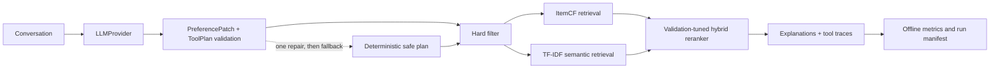

# RecAgent-Eval

An evaluation-first conversational movie recommendation agent for the
search/recommendation × LLM setting.

RecAgent-Eval makes one separation explicit:

- the LLM extracts preferences and produces a schema-validated tool plan;
- deterministic modules enforce constraints, retrieve candidates, rerank, and
  calculate reproducible metrics.

The project is independently implemented and inspired by the tool-oriented
workflow of [Microsoft RecAI / InteRecAgent](https://github.com/microsoft/RecAI/tree/main/InteRecAgent).
See [NOTICE](NOTICE) for attribution.

## Architecture



Public interfaces live in:

- `LLMProvider.chat(messages, response_schema, timeout) -> LLMResponse`
- `PreferenceState` / `PreferencePatch`
- `ToolPlan` / `ToolStep`
- `RecommendationResult`

## Quick start

Requires Python 3.11 or newer and [uv](https://docs.astral.sh/uv/).

```bash
uv sync --extra dev
uv run recagent-eval smoke --output artifacts/runs/smoke
uv run pytest
```

Download MovieLens 1M and reproduce the fixed evaluation:

```bash
uv run recagent-eval download-data --output data/raw
uv run recagent-eval prepare-cases \
  --data-dir data/raw/ml-1m \
  --output cases/fixed_cases.json
uv run recagent-eval tune \
  --data-dir data/raw/ml-1m \
  --output artifacts/tuned_weights.json
uv run recagent-eval evaluate \
  --config configs/full.yaml \
  --cases cases/fixed_cases.json \
  --data-dir data/raw/ml-1m \
  --output artifacts/runs/full-rule \
  --provider rule-based
```

The checked-in cases contain 40 single-turn and 10 multi-turn episodes. Ratings
are split chronologically per user: the penultimate positive item is validation,
the latest positive item is test, and neither is used to fit ItemCF.

## LLM runs

DeepSeek:

```bash
export DEEPSEEK_API_KEY="..."
scripts/run_deepseek_matrix.sh
```

The script runs the three 50-case variants and repeats a stratified 20-case
subset for stability.

Local Qwen through vLLM on an RTX 4090:

```bash
scripts/run_remote_qwen.sh
```

Secrets are read only from environment variables and are not written to run
manifests. Detailed setup and measurement commands are in
[docs/remote-4090.md](docs/remote-4090.md).

Interactive demo:

```bash
uv sync --extra demo
export DEEPSEEK_API_KEY="..."
uv run --extra demo python -m recagent_eval.demo
```

## Current verified result

The local rule-based provider run verifies the recommendation and evaluation
pipeline without claiming LLM quality:

| Variant | Recall@10 | NDCG@10 | Plan valid | Constraints | Tool success |
| --- | ---: | ---: | ---: | ---: | ---: |
| Unstructured, no memory | 0.0600 | 0.0486 | 0% | 100% | 100% |
| Structured + memory | 0.0600 | 0.0360 | 100% | 100% | 100% |
| Full hybrid | 0.0800 | 0.0418 | 100% | 100% | 100% |

The full model improves held-out hit/recall from 6% to 8%, but does **not** beat
the baseline NDCG. That negative result is retained in
[reports/experiments/offline-rule-based.md](reports/experiments/offline-rule-based.md).

The formal DeepSeek matrix is also complete:

| Variant | Recall@10 | NDCG@10 | Plan valid | Fallback | Constraints |
| --- | ---: | ---: | ---: | ---: | ---: |
| Unstructured, no memory | 0.0600 | 0.0486 | N/A | 0% | 100% |
| Structured + memory | 0.0400 | 0.0326 | 84% | 16% | 100% |
| Full hybrid | 0.0400 | 0.0226 | 86% | 14% | 100% |
| Full, 20-case repeat | 0.0000 | 0.0000 | 90% | 10% | 100% |

The plan-validity target was not met; failures were concentrated entirely in
multi-turn episodes. See the
[DeepSeek report](reports/experiments/deepseek-formal.md) for token use,
latency, metric caveats, and the next falsifiable experiment. Remote Qwen
numbers remain pending until the RTX 4090 host is free.

## Testing and evidence

```bash
uv run pytest
uv run ruff check .
```

The suite covers schemas, memory updates, invalid plans, one-shot repair,
provider retries, chronological splitting, hard constraints, retrieval,
ranking, weight tuning, metrics, CLI smoke tests, and deterministic manifests.

- Upstream audit: [reports/audit/overview.md](reports/audit/overview.md)
- Candidate ranking: [reports/ranking/candidate_score.md](reports/ranking/candidate_score.md)
- Core walkthrough: [docs/core-code-walkthrough.md](docs/core-code-walkthrough.md)
- Interview material: [reports/interview-pack/interview-pack.md](reports/interview-pack/interview-pack.md)

## Limitations

- TF-IDF uses MovieLens title/genre text; it is deliberately lightweight and is
  not a learned sentence embedding model.
- The formal DeepSeek run exposed a mismatch between exact preference-state
  labels and semantically equivalent hard/soft exclusions; retention=0 is not
  used as a project claim.
- The current hybrid improves coverage but not NDCG. A learned or calibrated
  second-stage ranker is intentionally outside v1.
- MovieLens data is downloaded separately and remains subject to GroupLens
  terms.
