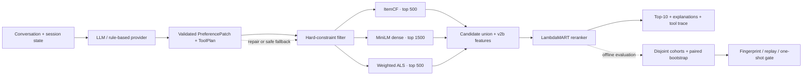
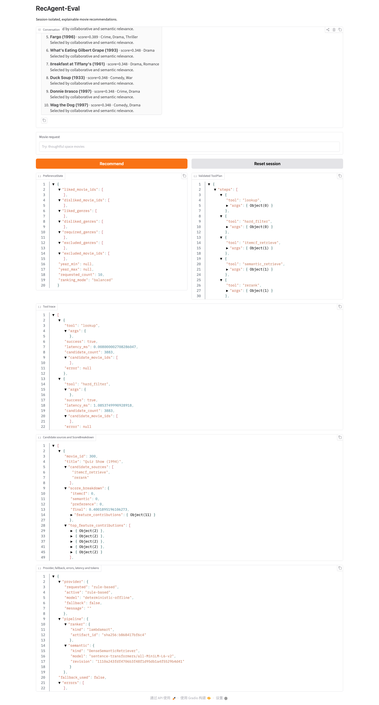

# RecAgent-Eval

[](https://github.com/Sh1njuuovo/recagent-eval/actions/workflows/ci.yml)


An evaluation-first conversational recommender that combines structured LLM
planning with deterministic retrieval, learned ranking, and leakage-safe
offline evaluation on MovieLens 1M.

The LLM interprets the conversation and emits a validated tool plan. The
recommendation stack then enforces hard constraints, retrieves candidates from
three complementary routes, and reranks them with a 16-feature LambdaMART model.
The complete offline algorithm path runs on CPU; an API key is optional.

## Result at a glance

The primary result comes from **Confirmation-B: 1,000 users excluded from model
selection**, evaluated with 2,000 user-level paired-bootstrap resamples.

| Method | Recall@10 | NDCG@10 | Constraints |
| --- | ---: | ---: | ---: |
| **RecAgent current_v2b** | **0.118** | **0.0555** | **100%** |
| ALS direct | 0.069 | 0.0323 | 100% |
| ItemCF direct | 0.064 | 0.0323 | 100% |
| BPR-MF | 0.047 | 0.0205 | 100% |
| LightGCN | 0.035 | 0.0163 | 100% |
| Popularity | 0.044 | 0.0187 | 100% |

- vs ItemCF: NDCG@10 `+0.0231`, 95% CI `[0.0118, 0.0346]`
- vs ALS: NDCG@10 `+0.0232`, 95% CI `[0.0111, 0.0346]`
- Recall@10 improves by **84% relative** over ItemCF (`0.118` vs `0.064`)

See the [strong-baseline report](reports/experiments/v2-strong-baselines-confirmation-b.md)
and its [machine-readable evidence](reports/experiments/v2-strong-baselines-confirmation-b.json).

## What is implemented

- **Structured conversational Agent** — typed `PreferencePatch` and `ToolPlan`,
  schema validation, one repair attempt, and deterministic safe fallback.
- **Three-route retrieval** — ItemCF for local collaborative signals,
  MiniLM dense retrieval for semantic intent, and weighted ALS with legal-history
  fold-in for global latent structure.
- **Two-stage ranking** — a fixed 16-feature `v2b` schema and leakage-safe
  LambdaMART trained with whole-user grouped CV.
- **Hard constraints and explanations** — watched/disliked items, genre and year
  constraints are enforced before ranking; recommendations expose source and
  score contributions.
- **Evidence governance** — chronological targets, disjoint cohorts, artifact
  fingerprints, paired bootstrap, fail-closed replay, and a permanently
  single-use promotion identity.
- **Local-first demo** — rule-based mode works without an API key; DeepSeek and
  OpenAI-compatible local providers are optional.

## Architecture



The main implementation is under [`src/recagent_eval`](src/recagent_eval).
For a guided reading order, use the [core code walkthrough](docs/core-code-walkthrough.md).

## Demo

The Gradio interface keeps conversation state per browser session and exposes
preferences, tool plans, retrieval sources, score breakdowns, fallbacks, and
errors.



The screenshot uses the rule-based provider and labels that mode in the runtime
panel. It demonstrates the UI and execution trace without presenting rule-based
output as LLM quality.

## Quick start

Requirements: Python 3.11+ and [uv](https://docs.astral.sh/uv/). `uv` creates and
uses the repository-local `.venv`; no global `pip` installation is required.

```bash
git clone https://github.com/Sh1njuuovo/recagent-eval.git
cd recagent-eval
uv sync --extra dev --extra ml
uv run recagent-eval smoke --output artifacts/runs/smoke
uv run pytest
```

Download MovieLens 1M and launch the API-key-free demo:

```bash
uv run recagent-eval download-data --output data/raw
uv sync --extra demo
uv run --extra demo recagent-eval demo \
  --data-dir data/raw/ml-1m \
  --provider rule-based
```

To use DeepSeek, set `DEEPSEEK_API_KEY` and replace the provider with
`deepseek`. Secrets are read from environment variables and excluded from run
manifests.

## Reproduce the published evidence

Replay the checked-in Confirmation-B aggregates and every paired-bootstrap
comparison from the compact evidence bundle:

```bash
uv run recagent-eval replay-evidence \
  --bundle reports/evidence/confirmation-b.compact.json \
  --ledger reports/audit/2026-08-23-cohort-ledger.json \
  --summary reports/experiments/v2-strong-baselines-confirmation-b.json
```

The replay validates schema versions, cohort identity and order, fingerprints,
finite metrics, and bootstrap outputs before accepting the evidence. Full model
training and dense-cache commands are documented in the
[experiment index](reports/README.md).

## Evaluation protocol

For each user, interactions are ordered by timestamp:

1. earlier interactions form legal training history;
2. the third-to-last positive target is used for ranker training;
3. the second-to-last positive target is used for validation/confirmation;
4. the latest positive target remains outside those stages.

Users are grouped across CV folds and the development, Confirmation-A,
Confirmation-B, and reserve cohorts are mutually exclusive. Confirmation-A was
used during baseline debugging, so **Confirmation-B is the sole certification
cohort**.

After the method was locked, a single-use 50-case promotion run produced
Recall@10 `0.0800`, NDCG@10 `0.03964`, and candidate-union recall `0.9400`.
That case suite had earlier system-level DeepSeek use and contained
**no matched ItemCF/ALS baselines**, so it is reported only as a small
generalization check.
The identity is permanently consumed and cannot be rerun or used for tuning.
No further tuning may use these 50 labels.

## Engineering highlights

- Root-caused a native macOS crash to three coexisting OpenMP runtimes loaded by
  torch, LightGBM, and scikit-learn; guarded the single-thread fix with
  subprocess regression tests.
- Persisted dense and ALS artifacts with schema, data fingerprint, dependency
  identity, shape, dtype, checksum, and atomic publication checks; no pickle.
- Preserved failed hypotheses, including percentile score calibration and
  route-balanced hard-negative sampling, and used them to isolate ranking depth
  as the remaining bottleneck.
- CI runs Ruff, the 439-test suite, and a CLI smoke test on Ubuntu/Python 3.11.

## Repository guide

| Path | Purpose |
| --- | --- |
| [`src/recagent_eval`](src/recagent_eval) | Agent, retrieval, ranking, evaluation, and CLI code |
| [`tests`](tests) | Unit, regression, leakage, replay, CLI, and promotion tests |
| [`configs`](configs) | Versioned baseline, dense, latent, and v2b configurations |
| [`docs`](docs) | Architecture, demo, methodology, and operating guides |
| [`reports`](reports) | Curated results plus machine-readable evidence index |
| [`.github/workflows/ci.yml`](.github/workflows/ci.yml) | Reproducible CI gate |

Recommended reading:

1. [Final strong-baseline comparison](reports/experiments/v2-strong-baselines-confirmation-b.md)
2. [Final promotion evaluation and claim boundary](reports/experiments/v2-final-promotion-evaluation.md)
3. [Core code walkthrough](docs/core-code-walkthrough.md)
4. [Ten-minute demo script](docs/demo-script.md)
5. [Complete evidence index](reports/README.md)

## Scope and limitations

- MovieLens 1M provides title, genre, timestamp, and rating signals but no rich
  plot text; dense semantic recall is therefore limited by item metadata.
- Confirmation-B is the main statistical comparison. The 50-case promotion is
  a point estimate with an intentionally narrower claim.
- Candidate-union coverage is substantially higher than Top-10 hit rate, so
  second-stage ranking depth remains the clearest improvement target.
- The current algorithm evidence is CPU-only. The repository includes a
  loopback-only Qwen3-8B/vLLM runbook, but no 4090 throughput or memory result is
  claimed.
- MovieLens data is downloaded separately and remains subject to GroupLens
  terms.

## Attribution and license

The implementation is independent and inspired by the tool-oriented workflow
of [Microsoft RecAI / InteRecAgent](https://github.com/microsoft/RecAI/tree/main/InteRecAgent).
See [NOTICE](NOTICE) for attribution. Code in this repository is released under
the [MIT License](LICENSE).
