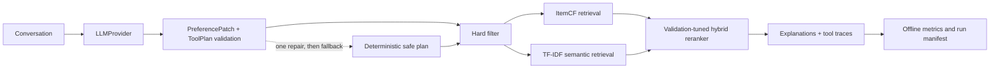

# RecAgent-Eval


An evaluation-first conversational movie recommendation Agent that separates
LLM preference understanding from deterministic filtering, retrieval, ranking,
and frozen-test evaluation.

**Verified evidence:** the early 500-user dense/LambdaMART variants preserved
their negative results and motivated candidate-depth diagnosis. Adding the ALS
latent route raised latent recall@500 to 0.838, union recall to 0.928, and moved
the median target rank to 93. The final seed-42 Confirmation-B cohort contains
1,000 previously unused users: current_v2b reaches Recall@10 0.118 and NDCG@10
0.0555 versus ItemCF 0.064/0.0323 and ALS 0.069/0.0323. User-level paired
bootstrap lower bounds are positive and constraints remain 100%. Confirmation-A
is development/debugging evidence; Confirmation-B is the sole certification.
After locking current_v2b, the project completed one final 50-case promotion
evaluation (Recall@10 0.08, NDCG@10 0.03964) under a permanently consumed
one-shot identity. The same case suite had earlier DeepSeek system use, so this
run is a generalization supplement rather than a historically untouched
holdout. Qwen/4090 remains pending.

RecAgent-Eval makes one separation explicit:

- the LLM extracts preferences and produces a schema-validated tool plan;
- deterministic modules enforce constraints, retrieve candidates, rerank, and
  calculate reproducible metrics.

The project is independently implemented and inspired by the tool-oriented
workflow of [Microsoft RecAI / InteRecAgent](https://github.com/microsoft/RecAI/tree/main/InteRecAgent).
See [NOTICE](NOTICE) for attribution.

## Start here

- [Formal DeepSeek evaluation](reports/experiments/deepseek-constraint-aware.md)
- [current_v2b final promotion evaluation](reports/experiments/v2-final-promotion-evaluation.md)
- [Offline ranker gate](reports/experiments/offline-ranker-selection.md)
- [v2 dense LambdaMART validation](reports/experiments/v2-dense-lambdamart-500user.md)
- [v2 recall-1500 LambdaMART validation](reports/experiments/v2-dense-lambdamart-recall1500.md)
- [v2 ranker diagnostics](reports/experiments/v2-ranker-diagnostics.md)
- [v2 percentile-calibrated validation](reports/experiments/v2-dense-lambdamart-recall1500-percentile.md)
- [Ten-minute demo script](docs/demo-script.md)
- [Core code walkthrough](docs/core-code-walkthrough.md)
- [Interview pack](reports/interview-pack/interview-pack.md)

## Architecture



Public interfaces live in:

- `LLMProvider.chat(messages, response_schema, timeout) -> LLMResponse`
- `PreferenceState` / `PreferencePatch`
- `ToolPlan` / `ToolStep`
- `RecommendationResult`

## Quick start

Requires Python 3.11 or newer and [uv](https://docs.astral.sh/uv/).

```bash
uv sync --extra dev
uv run recagent-eval smoke --output artifacts/runs/smoke
uv run pytest
```

Download MovieLens 1M and reproduce the fixed evaluation:

```bash
uv run recagent-eval download-data --output data/raw
uv run recagent-eval prepare-cases \
  --data-dir data/raw/ml-1m \
  --output cases/fixed_cases.json
uv run recagent-eval select-retrieval \
  --data-dir data/raw/ml-1m \
  --evidence-output artifacts/retrieval_ablation.json \
  --config-output configs/full_constraint_aware.yaml
uv run recagent-eval tune \
  --data-dir data/raw/ml-1m \
  --config configs/full_constraint_aware.yaml \
  --config-output configs/full_constraint_aware.yaml \
  --output artifacts/tuned_weights_constraint_aware.json
uv run recagent-eval select-ranker \
  --config configs/full_constraint_aware.yaml \
  --data-dir data/raw/ml-1m \
  --evidence-output artifacts/ranker_ablation.json \
  --config-output configs/full_ranker_selected.yaml \
  --max-users 500
uv run recagent-eval evaluate \
  --config configs/full_constraint_aware.yaml \
  --cases cases/fixed_cases.json \
  --data-dir data/raw/ml-1m \
  --output artifacts/runs/full-constraint-aware-rule \
  --provider rule-based
```

## Dense retrieval and LambdaMART (v2)

The v2 path adds offline dense retrieval and a leakage-safe LambdaMART ranker
with whole-user three-fold CV, evidence replay, and a single-use frozen gate.

Build the real dense cache (once, CPU):

```bash
uv run recagent-eval build-embeddings \
  --data-dir data/raw/ml-1m \
  --output artifacts/embeddings/movielens-minilm.npz \
  --model-name sentence-transformers/all-MiniLM-L6-v2 \
  --device cpu
```

Train and validate the LambdaMART ranker (30-user stability run first, then the
intended 500-user validation):

```bash
HF_HUB_OFFLINE=1 TRANSFORMERS_OFFLINE=1 \
  uv run recagent-eval train-ranker \
  --config configs/v2_dense_validation.yaml \
  --data-dir data/raw/ml-1m \
  --cases cases/fixed_cases.json \
  --output artifacts/experiments/v2-500/model.json \
  --evidence-output artifacts/experiments/v2-500/validation.json \
  --bundle-manifest-output artifacts/experiments/v2-500/bundle.json \
  --max-users 500
```

The run publishes a model/evidence bundle only when the preregistered
conditions hold (LambdaMART NDCG@10 above ItemCF, paired-bootstrap 95% CI lower
bound above zero, constraint satisfaction 100%). The frozen consumption path is
deliberately single-use and fail-closed:

```bash
uv run recagent-eval evaluate-ranker --help
```

Offline Demo (rule-based provider, dense semantic, LambdaMART artifact; no API
key needed):

```bash
HF_HUB_OFFLINE=1 TRANSFORMERS_OFFLINE=1 \
  uv run --extra demo recagent-eval demo \
  --data-dir data/raw/ml-1m \
  --provider rule-based \
  --semantic-config configs/v2_dense_validation.yaml \
  --ranker-config configs/v2_demo_lambdamart.yaml
```

Real local screenshot (rule-based output labeled in the runtime panel):
[reports/demo/v2-demo-lambdamart-rule-based.png](reports/demo/v2-demo-lambdamart-rule-based.png).

The checked-in cases contain 40 single-turn and 10 multi-turn episodes. Ratings
are split chronologically per user: the penultimate positive item is validation,
the latest positive item is test, and neither is used to fit ItemCF.

## LLM runs

DeepSeek:

```bash
export DEEPSEEK_API_KEY="..."
scripts/run_deepseek_matrix.sh
```

The script runs the three 50-case variants and repeats a stratified 20-case
subset for stability.

Local Qwen through vLLM on an RTX 4090:

```bash
scripts/run_remote_qwen.sh
```

Secrets are read only from environment variables and are not written to run
manifests. Detailed setup and measurement commands are in
[docs/remote-4090.md](docs/remote-4090.md).

Interactive demo:

```bash
uv sync --extra demo
export DEEPSEEK_API_KEY="..."
uv run --extra demo python -m recagent_eval.demo
```

## Current verified result

The constraint-aware DeepSeek matrix uses one fixed case fingerprint and a
validation-selected Top-500 candidate budget for every formal variant:

| Variant | Recall@10 | NDCG@10 | Union candidate recall | Plan valid | Pipeline | Constraints |
| --- | ---: | ---: | ---: | ---: | ---: | ---: |
| Unstructured, no memory | 0.0600 | **0.0486** | 0.5800 | N/A | 100% | 100% |
| Structured + memory | **0.0600** | 0.0360 | 0.7800 | 100% | 100% | 100% |
| Full hybrid | 0.0400 | 0.0149 | **0.8800** | 100% | 100% | 100% |
| Full, 20-case stability | 0.0000 | 0.0000 | 0.7500 | 100% | 100% | 100% |

The hybrid route improves candidate coverage by 10 percentage points over the
same-depth ItemCF variant, but does not improve top-10 ranking. This negative
result is retained rather than filtered. See the
[constraint-aware DeepSeek report](reports/experiments/deepseek-constraint-aware.md)
for validation ablations, fingerprints, latency, token usage, and failure
analysis. A
[machine-readable summary](reports/experiments/deepseek-constraint-aware.json)
contains the same fixed-case aggregate metrics. This formal case fingerprint
was later reused for the one-time current_v2b promotion evaluation; it is not a
project-history-clean holdout.

### Offline ranker gate

The validation-only follow-up compared ItemCF, the existing min-max control,
four RRF settings, and eleven percentile-fusion weights on identical Top-500
candidates. RRF and genuine two-route percentile fusion did not strictly beat
ItemCF validation NDCG@10, so the frozen test remained locked and no additional
DeepSeek run was made. The existing min-max row remained an informative control
only because its previously selected formal hybrid had already failed on the
frozen test.

See the
[offline ranker selection report](reports/experiments/offline-ranker-selection.md)
and [machine-readable ablation](artifacts/ranker_ablation.json). The CLI writes
`configs/full_ranker_selected.yaml` only when a newly eligible ranker passes the
strict validation gate.

### v2 dense LambdaMART gate

The leakage-safe LambdaMART validation ran on the real dense cache and fixed
case set. A native LightGBM segmentation fault in the torch-loaded dense process
was root-caused to three coexisting OpenMP runtimes (torch, LightGBM,
scikit-learn each load their own `libomp.dylib`) and fixed by pinning LightGBM
to one thread and capping OMP threads at model load. After the fix, the 30-user
stability run and the formal 500-user run both complete and publish bundles.

| Metric (500 validation users, 408 training groups) | Value |
| --- | ---: |
| LambdaMART mean NDCG@10 | 0.0327 |
| ItemCF mean NDCG@10 | 0.0334 |
| Mean NDCG@10 delta | −0.0007 |
| Paired-bootstrap 95% CI (delta) | [−0.0146, 0.0129] |
| Union candidate recall | 0.776 |
| ItemCF candidate recall | 0.696 |
| Dense candidate recall | 0.288 |
| Recall@10 / HitRate@10 (both rankers) | 0.064 |
| Constraint satisfaction rate | 1.000 |

The gate stays locked: LambdaMART does not beat ItemCF with confidence. The
negative result is preserved in
[reports/experiments/v2-dense-lambdamart-500user.md](reports/experiments/v2-dense-lambdamart-500user.md)
and the JSON summary, and the evidence files live under
`artifacts/experiments/v2-500/`.

### Candidate-recall sweep and recall-1500 follow-up

`ablate-candidates` measures dense/ItemCF/union candidate recall over the same
500 validation users without training a ranker:

```bash
HF_HUB_OFFLINE=1 TRANSFORMERS_OFFLINE=1 \
  uv run recagent-eval ablate-candidates \
  --config configs/v2_dense_validation.yaml \
  --data-dir data/raw/ml-1m \
  --output artifacts/experiments/v2-recall-sweep/recall.json \
  --max-users 500
```

The sweep selected `semantic.top_k=1500` (dense recall 0.612, union recall
0.878). Retraining under `configs/v2_dense_recall1500.yaml` still failed the
ranking gate (NDCG@10 0.0299 vs ItemCF 0.0334, bootstrap CI crosses zero), so
that historical promotion gate remained locked and the negative result is preserved in
[v2-dense-lambdamart-recall1500.md](reports/experiments/v2-dense-lambdamart-recall1500.md).

### Ranking diagnostics and score calibration

`diagnose-ranker` writes a read-only per-user ranking diagnostic over the same
validation set:

```bash
HF_HUB_OFFLINE=1 TRANSFORMERS_OFFLINE=1 \
  uv run recagent-eval diagnose-ranker \
  --config configs/v2_dense_recall1500.yaml \
  --data-dir data/raw/ml-1m \
  --cases cases/fixed_cases.json \
  --model artifacts/experiments/v2-recall-1500/model.json \
  --output artifacts/experiments/v2-ranker-diagnostics/diagnostics.json \
  --max-users 500
```

The diagnostic shows the target's median rank is ~172 in both ItemCF and
LambdaMART, and only `itemcf_score`/popularity separate targets from negatives;
dense score features are anti-predictive on this set. A percentile calibration
variant (`ranker.score_calibration=percentile`) was evaluated and made ranking
worse (LambdaMART recall@10 0.066 → 0.038), so it is recorded as a falsified
hypothesis; both the diagnostics and the percentile negative result are
preserved in the reports linked above.

The [archived first DeepSeek report](reports/experiments/deepseek-formal.md)
documents the invalid-label and policy-drift failures that motivated the revised
evaluator. The fingerprints differ, so the two result tables are not merged.
Remote Qwen numbers remain pending until the RTX 4090 host is free.

### Collaborative latent recall (ALS) and schema-v2 artifacts

A deterministic weighted-ALS latent route (`src/recagent_eval/latent_retrieval.py`,
numpy-only, `threadpoolctl`-pinned, standard fold-in scoring, no pickle) was
added as a third candidate source with schema-v2 features
(`candidate-features/v2`: latent score/rank/membership) and schema-v2
artifact/evidence/bundle contracts bound to the persisted latent artifact
checksum. The candidate-stage gates all passed on 500 validation users
([v2-latent-diagnostics](reports/experiments/v2-latent-diagnostics.md)):
latent recall@500 0.838, target median rank in the latent list 93 (vs ~172
ItemCF union-order baseline), three-route union recall 0.928, latent-only
coverage 5%, latent recall@10 0.084 (all users; ItemCF 0.064).

The 30-user smoke ([v2-latent-smoke-30](reports/experiments/v2-latent-smoke-30.md))
confirmed bundle-v2 integrity, a byte-identical replay (rows, model, and latent
factors), and 100% constraints. Three 500-user LambdaMART validations were then
run and **all preserved as negative results**; at that historical stage the
promotion gate stayed locked:

| Variant | LambdaMART NDCG@10 | ItemCF NDCG@10 | Recall@10 | Bootstrap 95% CI | Gate |
| --- | ---: | ---: | ---: | --- | --- |
| v2 + route-balanced hard negatives ([latent500](reports/experiments/v2-dense-lambdamart-latent500.md)) | 0.0 | 0.0334 | 0.000 | [−0.0461, −0.0213] | failed |
| v2 + all negatives ([allneg](reports/experiments/v2-dense-lambdamart-latent-allneg.md)) | 0.0258 | 0.0334 | 0.060 | [−0.0214, 0.0073] | failed |
| v2b + all negatives ([bfeat](reports/experiments/v2-dense-lambdamart-latent-bfeat.md)) | 0.0446 | 0.0334 | 0.102 | [−0.0024, 0.0280] | failed (NDCG↑, CI lower < 0) |

The route-balanced hard-negative policy (200 negatives/query) was found to
catastrophically break generalization (0 hits, median target rank 1607) in a
controlled attribution; the latent features themselves improve ranking depth
with all-negatives training. The v2b contingency (cross/recent/year features)
produces the best learned ranking so far but still misses the pre-registered
confidence gate at its lower tail.

### Strong-baseline evaluation

A pre-registered, untouched-cohort evaluation phase
([design](docs/superpowers/specs/2026-08-23-strong-baselines-design.md),
[plan](docs/superpowers/plans/2026-08-23-strong-baselines.md)) was added to
answer whether the current method is competitive against strong baselines.
The fixed cohort ledger
([JSON](reports/audit/2026-08-23-cohort-ledger.json), fingerprint
`7153c15e...`) assigns mutually exclusive development (600), confirmation-A
(1000), confirmation-B (1000), and reserve (2891) cohorts from the 5,491
users never used in earlier selection, using validation targets only.

The unified harness (`evaluate-baselines`) reports Recall/NDCG/MRR@10,
coverage, constraint satisfaction, candidate recall, p50/p95 latency,
training time, memory, and model size, with user-level 2,000 paired bootstrap
deltas. Six methods are implemented (each with determinism/leakage/
serialization tests and a 30-user smoke): Popularity, ItemCF direct, ALS
direct (dev-CV hyperparameters), BPR-MF, LightGCN, and the current v2b method
(trained on historical-500 ∪ development, evaluated on confirmation cohorts).

Confirmation-A was read before baseline implementation/metric corrections and
is therefore development/debugging/replication evidence. Seed-42 Confirmation-B
is the sole final certification cohort: current_v2b NDCG@10 is 0.0555 versus
ItemCF 0.0323 and ALS direct 0.0323; its deltas are +0.0231 [0.0118, 0.0346]
and +0.0232 [0.0111, 0.0346]. Recall@10 is 0.118 versus ItemCF 0.064 (+84%
relative), with 100% constraints. The BPR/LightGCN seed-7/2026 work is labeled
post-hoc robustness and cannot change Success A.

### One-time final promotion evaluation

After current_v2b, its package, and canonical identity were locked, the
single-use promotion path ran once on the 50 fixed cases and completed with
Recall@10 0.08 and NDCG@10 0.03964. Candidate union recall was 0.94 (47/50),
while Top-10 hit rate was 0.08 (4/50), reinforcing ranking depth as the main
remaining bottleneck.

This is a small-sample generalization supplement. The same case fingerprint
had already appeared in the historical DeepSeek system experiment, and the
promotion run did not execute matched ItemCF/ALS baselines. It supports neither
a historically untouched-holdout claim nor a significant baseline-win claim.
See the
[final promotion report](reports/experiments/v2-final-promotion-evaluation.md).
No further tuning may use these 50 labels; a v3 effort must preregister a new,
unused holdout before development.

## Testing and evidence

```bash
uv run pytest
uv run ruff check .
```

The 439-test suite covers schemas, memory updates, invalid plans, one-shot repair,
provider retries, chronological splitting, case-label preflight, frozen
retrieval policy, hard constraints, route-level diagnostics, retrieval
selection, ranking, weight tuning, metrics, CLI smoke tests, scripts, and
deterministic manifests, rank-fusion calibration, evidence invariants, and the
frozen-case gate, dense-cache integrity, and the torch/LightGBM OpenMP crash
regressions, plus ALS fold-in determinism, latent artifact persistence, and
schema-v2 contract dispatch. Current line coverage is 90.04%.

- Upstream audit: [reports/audit/overview.md](reports/audit/overview.md)
- Candidate ranking: [reports/ranking/candidate_score.md](reports/ranking/candidate_score.md)
- Core walkthrough: [docs/core-code-walkthrough.md](docs/core-code-walkthrough.md)
- Interview material: [reports/interview-pack/interview-pack.md](reports/interview-pack/interview-pack.md)

## Limitations

- TF-IDF uses MovieLens title/genre text; it is deliberately lightweight and is
  not a learned sentence embedding model.
- The early v1 hybrid improved candidate coverage without improving Recall@10
  or NDCG@10. That historical negative result remains part of the diagnosis.
- Dense retrieval uses `all-MiniLM-L6-v2`; on this Mac its OpenMP runtime
  conflicts with LightGBM's, so LambdaMART is pinned to a single thread and
  model load caps `OMP_NUM_THREADS`. This is a documented local-runtime guard,
  not a model-quality change.
- The v2 LambdaMART validations did not pass the ItemCF gate. Widening the
  dense top-k fixed candidate recall (union 87.8%), but the target still ranks
  deep (median ~172), so Top-10 NDCG is bounded; percentile score calibration
  was tested and hurt ranking. The remaining bottleneck is ranking depth and
  separating features beyond the raw ItemCF score.
- The ALS latent route lifts candidate depth (median 93, union recall 92.8%)
  and the v2b features raise LambdaMART recall@10 to 0.102, but the formal
  ItemCF gate remains locked: the best variant's paired-bootstrap CI lower
  bound (−0.0024) still crosses zero. Route-balanced hard-negative sampling
  was evaluated and found to break generalization; it is retained as a
  falsified hypothesis, not a tuning success.
- Confirmation-B establishes the later v2b result; its 1,000-user evidence is
  distinct from the earlier 500-user LambdaMART experiments. Peak RSS is not
  compared until corrected independent-process measurements exist.
- The 50-case promotion result is a one-time point estimate on a case suite
  previously used by the DeepSeek system experiment. No matched ItemCF/ALS
  promotion baseline or significance result exists; the suite is permanently
  excluded from further tuning.
- The unstructured no-memory baseline falls back to popularity retrieval, so its
  strong NDCG on 50 fixed cases should not be generalized beyond this matrix.
- MovieLens data is downloaded separately and remains subject to GroupLens
  terms.
