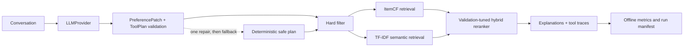

# RecAgent-Eval


An evaluation-first conversational movie recommendation Agent that separates
LLM preference understanding from deterministic filtering, retrieval, ranking,
and frozen-test evaluation.

**Verified evidence:** structured Agent reliability and hard-constraint metrics
reach 100%; hybrid retrieval raises candidate union recall from 78% to 88%, but
the retained full-system NDCG@10 is 0.0149. A validation-only RRF/percentile
follow-up did not pass the preregistered ItemCF gate, so the frozen test was not
rerun.

RecAgent-Eval makes one separation explicit:

- the LLM extracts preferences and produces a schema-validated tool plan;
- deterministic modules enforce constraints, retrieve candidates, rerank, and
  calculate reproducible metrics.

The project is independently implemented and inspired by the tool-oriented
workflow of [Microsoft RecAI / InteRecAgent](https://github.com/microsoft/RecAI/tree/main/InteRecAgent).
See [NOTICE](NOTICE) for attribution.

## Start here

- [Formal DeepSeek evaluation](reports/experiments/deepseek-constraint-aware.md)
- [Offline ranker gate](reports/experiments/offline-ranker-selection.md)
- [Ten-minute demo script](docs/demo-script.md)
- [Core code walkthrough](docs/core-code-walkthrough.md)
- [Interview pack](reports/interview-pack/interview-pack.md)

## Architecture



Public interfaces live in:

- `LLMProvider.chat(messages, response_schema, timeout) -> LLMResponse`
- `PreferenceState` / `PreferencePatch`
- `ToolPlan` / `ToolStep`
- `RecommendationResult`

## Quick start

Requires Python 3.11 or newer and [uv](https://docs.astral.sh/uv/).

```bash
uv sync --extra dev
uv run recagent-eval smoke --output artifacts/runs/smoke
uv run pytest
```

Download MovieLens 1M and reproduce the fixed evaluation:

```bash
uv run recagent-eval download-data --output data/raw
uv run recagent-eval prepare-cases \
  --data-dir data/raw/ml-1m \
  --output cases/fixed_cases.json
uv run recagent-eval select-retrieval \
  --data-dir data/raw/ml-1m \
  --evidence-output artifacts/retrieval_ablation.json \
  --config-output configs/full_constraint_aware.yaml
uv run recagent-eval tune \
  --data-dir data/raw/ml-1m \
  --config configs/full_constraint_aware.yaml \
  --config-output configs/full_constraint_aware.yaml \
  --output artifacts/tuned_weights_constraint_aware.json
uv run recagent-eval select-ranker \
  --config configs/full_constraint_aware.yaml \
  --data-dir data/raw/ml-1m \
  --evidence-output artifacts/ranker_ablation.json \
  --config-output configs/full_ranker_selected.yaml \
  --max-users 500
uv run recagent-eval evaluate \
  --config configs/full_constraint_aware.yaml \
  --cases cases/fixed_cases.json \
  --data-dir data/raw/ml-1m \
  --output artifacts/runs/full-constraint-aware-rule \
  --provider rule-based
```

The checked-in cases contain 40 single-turn and 10 multi-turn episodes. Ratings
are split chronologically per user: the penultimate positive item is validation,
the latest positive item is test, and neither is used to fit ItemCF.

## LLM runs

DeepSeek:

```bash
export DEEPSEEK_API_KEY="..."
scripts/run_deepseek_matrix.sh
```

The script runs the three 50-case variants and repeats a stratified 20-case
subset for stability.

Local Qwen through vLLM on an RTX 4090:

```bash
scripts/run_remote_qwen.sh
```

Secrets are read only from environment variables and are not written to run
manifests. Detailed setup and measurement commands are in
[docs/remote-4090.md](docs/remote-4090.md).

Interactive demo:

```bash
uv sync --extra demo
export DEEPSEEK_API_KEY="..."
uv run --extra demo python -m recagent_eval.demo
```

## Current verified result

The constraint-aware DeepSeek matrix uses one fixed case fingerprint and a
validation-selected Top-500 candidate budget for every formal variant:

| Variant | Recall@10 | NDCG@10 | Union candidate recall | Plan valid | Pipeline | Constraints |
| --- | ---: | ---: | ---: | ---: | ---: | ---: |
| Unstructured, no memory | 0.0600 | **0.0486** | 0.5800 | N/A | 100% | 100% |
| Structured + memory | **0.0600** | 0.0360 | 0.7800 | 100% | 100% | 100% |
| Full hybrid | 0.0400 | 0.0149 | **0.8800** | 100% | 100% | 100% |
| Full, 20-case stability | 0.0000 | 0.0000 | 0.7500 | 100% | 100% | 100% |

The hybrid route improves candidate coverage by 10 percentage points over the
same-depth ItemCF variant, but does not improve top-10 ranking. This negative
result is retained rather than filtered. See the
[constraint-aware DeepSeek report](reports/experiments/deepseek-constraint-aware.md)
for validation ablations, fingerprints, latency, token usage, and failure
analysis. A
[machine-readable summary](reports/experiments/deepseek-constraint-aware.json)
contains the same frozen aggregate metrics.

### Offline ranker gate

The validation-only follow-up compared ItemCF, the existing min-max control,
four RRF settings, and eleven percentile-fusion weights on identical Top-500
candidates. RRF and genuine two-route percentile fusion did not strictly beat
ItemCF validation NDCG@10, so the frozen test remained locked and no additional
DeepSeek run was made. The existing min-max row remained an informative control
only because its previously selected formal hybrid had already failed on the
frozen test.

See the
[offline ranker selection report](reports/experiments/offline-ranker-selection.md)
and [machine-readable ablation](artifacts/ranker_ablation.json). The CLI writes
`configs/full_ranker_selected.yaml` only when a newly eligible ranker passes the
strict validation gate.

The [archived first DeepSeek report](reports/experiments/deepseek-formal.md)
documents the invalid-label and policy-drift failures that motivated the revised
evaluator. The fingerprints differ, so the two result tables are not merged.
Remote Qwen numbers remain pending until the RTX 4090 host is free.

## Testing and evidence

```bash
uv run pytest
uv run ruff check .
```

The 79-test suite covers schemas, memory updates, invalid plans, one-shot repair,
provider retries, chronological splitting, case-label preflight, frozen
retrieval policy, hard constraints, route-level diagnostics, retrieval
selection, ranking, weight tuning, metrics, CLI smoke tests, scripts, and
deterministic manifests, rank-fusion calibration, evidence invariants, and the
frozen-case gate. Current line coverage is 90%.

- Upstream audit: [reports/audit/overview.md](reports/audit/overview.md)
- Candidate ranking: [reports/ranking/candidate_score.md](reports/ranking/candidate_score.md)
- Core walkthrough: [docs/core-code-walkthrough.md](docs/core-code-walkthrough.md)
- Interview material: [reports/interview-pack/interview-pack.md](reports/interview-pack/interview-pack.md)

## Limitations

- TF-IDF uses MovieLens title/genre text; it is deliberately lightweight and is
  not a learned sentence embedding model.
- The current hybrid improves candidate coverage but not Recall@10 or NDCG@10.
  A learned or calibrated second-stage ranker is intentionally outside v1.
- The unstructured no-memory baseline falls back to popularity retrieval, so its
  strong NDCG on 50 fixed cases should not be generalized beyond this matrix.
- MovieLens data is downloaded separately and remains subject to GroupLens
  terms.
