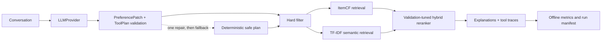

# RecAgent-Eval


An evaluation-first conversational movie recommendation Agent that separates
LLM preference understanding from deterministic filtering, retrieval, ranking,
and frozen-test evaluation.

**Verified evidence:** structured Agent reliability and hard-constraint metrics
reach 100%; dense retrieval and a leakage-safe LambdaMART pipeline run end to
end on real MovieLens-1M data. A candidate-recall sweep found the dense top-k
is the dominant lever (union recall 77.6% → 87.8%, dense 28.8% → 61.2% with
`semantic.top_k=1500`). Even with that candidate policy, the 500-user LambdaMART
validation kept constraint satisfaction at 100% but did not beat ItemCF NDCG@10
(0.0299 vs 0.0334, bootstrap 95% CI crosses zero), so the frozen test stays
locked; the negative result is preserved and the bottleneck is now the learned
ranker's feature quality/calibration rather than candidate recall.

RecAgent-Eval makes one separation explicit:

- the LLM extracts preferences and produces a schema-validated tool plan;
- deterministic modules enforce constraints, retrieve candidates, rerank, and
  calculate reproducible metrics.

The project is independently implemented and inspired by the tool-oriented
workflow of [Microsoft RecAI / InteRecAgent](https://github.com/microsoft/RecAI/tree/main/InteRecAgent).
See [NOTICE](NOTICE) for attribution.

## Start here

- [Formal DeepSeek evaluation](reports/experiments/deepseek-constraint-aware.md)
- [Offline ranker gate](reports/experiments/offline-ranker-selection.md)
- [v2 dense LambdaMART validation](reports/experiments/v2-dense-lambdamart-500user.md)
- [v2 recall-1500 LambdaMART validation](reports/experiments/v2-dense-lambdamart-recall1500.md)
- [Ten-minute demo script](docs/demo-script.md)
- [Core code walkthrough](docs/core-code-walkthrough.md)
- [Interview pack](reports/interview-pack/interview-pack.md)

## Architecture



Public interfaces live in:

- `LLMProvider.chat(messages, response_schema, timeout) -> LLMResponse`
- `PreferenceState` / `PreferencePatch`
- `ToolPlan` / `ToolStep`
- `RecommendationResult`

## Quick start

Requires Python 3.11 or newer and [uv](https://docs.astral.sh/uv/).

```bash
uv sync --extra dev
uv run recagent-eval smoke --output artifacts/runs/smoke
uv run pytest
```

Download MovieLens 1M and reproduce the fixed evaluation:

```bash
uv run recagent-eval download-data --output data/raw
uv run recagent-eval prepare-cases \
  --data-dir data/raw/ml-1m \
  --output cases/fixed_cases.json
uv run recagent-eval select-retrieval \
  --data-dir data/raw/ml-1m \
  --evidence-output artifacts/retrieval_ablation.json \
  --config-output configs/full_constraint_aware.yaml
uv run recagent-eval tune \
  --data-dir data/raw/ml-1m \
  --config configs/full_constraint_aware.yaml \
  --config-output configs/full_constraint_aware.yaml \
  --output artifacts/tuned_weights_constraint_aware.json
uv run recagent-eval select-ranker \
  --config configs/full_constraint_aware.yaml \
  --data-dir data/raw/ml-1m \
  --evidence-output artifacts/ranker_ablation.json \
  --config-output configs/full_ranker_selected.yaml \
  --max-users 500
uv run recagent-eval evaluate \
  --config configs/full_constraint_aware.yaml \
  --cases cases/fixed_cases.json \
  --data-dir data/raw/ml-1m \
  --output artifacts/runs/full-constraint-aware-rule \
  --provider rule-based
```

## Dense retrieval and LambdaMART (v2)

The v2 path adds offline dense retrieval and a leakage-safe LambdaMART ranker
with whole-user three-fold CV, evidence replay, and a single-use frozen gate.

Build the real dense cache (once, CPU):

```bash
uv run recagent-eval build-embeddings \
  --data-dir data/raw/ml-1m \
  --output artifacts/embeddings/movielens-minilm.npz \
  --model-name sentence-transformers/all-MiniLM-L6-v2 \
  --device cpu
```

Train and validate the LambdaMART ranker (30-user stability run first, then the
intended 500-user validation):

```bash
HF_HUB_OFFLINE=1 TRANSFORMERS_OFFLINE=1 \
  uv run recagent-eval train-ranker \
  --config configs/v2_dense_validation.yaml \
  --data-dir data/raw/ml-1m \
  --cases cases/fixed_cases.json \
  --output artifacts/experiments/v2-500/model.json \
  --evidence-output artifacts/experiments/v2-500/validation.json \
  --bundle-manifest-output artifacts/experiments/v2-500/bundle.json \
  --max-users 500
```

The run publishes a model/evidence bundle only when the preregistered
conditions hold (LambdaMART NDCG@10 above ItemCF, paired-bootstrap 95% CI lower
bound above zero, constraint satisfaction 100%). The frozen consumption path is
deliberately single-use and fail-closed:

```bash
uv run recagent-eval evaluate-ranker --help
```

Offline Demo (rule-based provider, dense semantic, LambdaMART artifact; no API
key needed):

```bash
HF_HUB_OFFLINE=1 TRANSFORMERS_OFFLINE=1 \
  uv run --extra demo recagent-eval demo \
  --data-dir data/raw/ml-1m \
  --provider rule-based \
  --semantic-config configs/v2_dense_validation.yaml \
  --ranker-config configs/v2_demo_lambdamart.yaml
```

Real local screenshot (rule-based output labeled in the runtime panel):
[reports/demo/v2-demo-lambdamart-rule-based.png](reports/demo/v2-demo-lambdamart-rule-based.png).

The checked-in cases contain 40 single-turn and 10 multi-turn episodes. Ratings
are split chronologically per user: the penultimate positive item is validation,
the latest positive item is test, and neither is used to fit ItemCF.

## LLM runs

DeepSeek:

```bash
export DEEPSEEK_API_KEY="..."
scripts/run_deepseek_matrix.sh
```

The script runs the three 50-case variants and repeats a stratified 20-case
subset for stability.

Local Qwen through vLLM on an RTX 4090:

```bash
scripts/run_remote_qwen.sh
```

Secrets are read only from environment variables and are not written to run
manifests. Detailed setup and measurement commands are in
[docs/remote-4090.md](docs/remote-4090.md).

Interactive demo:

```bash
uv sync --extra demo
export DEEPSEEK_API_KEY="..."
uv run --extra demo python -m recagent_eval.demo
```

## Current verified result

The constraint-aware DeepSeek matrix uses one fixed case fingerprint and a
validation-selected Top-500 candidate budget for every formal variant:

| Variant | Recall@10 | NDCG@10 | Union candidate recall | Plan valid | Pipeline | Constraints |
| --- | ---: | ---: | ---: | ---: | ---: | ---: |
| Unstructured, no memory | 0.0600 | **0.0486** | 0.5800 | N/A | 100% | 100% |
| Structured + memory | **0.0600** | 0.0360 | 0.7800 | 100% | 100% | 100% |
| Full hybrid | 0.0400 | 0.0149 | **0.8800** | 100% | 100% | 100% |
| Full, 20-case stability | 0.0000 | 0.0000 | 0.7500 | 100% | 100% | 100% |

The hybrid route improves candidate coverage by 10 percentage points over the
same-depth ItemCF variant, but does not improve top-10 ranking. This negative
result is retained rather than filtered. See the
[constraint-aware DeepSeek report](reports/experiments/deepseek-constraint-aware.md)
for validation ablations, fingerprints, latency, token usage, and failure
analysis. A
[machine-readable summary](reports/experiments/deepseek-constraint-aware.json)
contains the same frozen aggregate metrics.

### Offline ranker gate

The validation-only follow-up compared ItemCF, the existing min-max control,
four RRF settings, and eleven percentile-fusion weights on identical Top-500
candidates. RRF and genuine two-route percentile fusion did not strictly beat
ItemCF validation NDCG@10, so the frozen test remained locked and no additional
DeepSeek run was made. The existing min-max row remained an informative control
only because its previously selected formal hybrid had already failed on the
frozen test.

See the
[offline ranker selection report](reports/experiments/offline-ranker-selection.md)
and [machine-readable ablation](artifacts/ranker_ablation.json). The CLI writes
`configs/full_ranker_selected.yaml` only when a newly eligible ranker passes the
strict validation gate.

### v2 dense LambdaMART gate

The leakage-safe LambdaMART validation ran on the real dense cache and fixed
case set. A native LightGBM segmentation fault in the torch-loaded dense process
was root-caused to three coexisting OpenMP runtimes (torch, LightGBM,
scikit-learn each load their own `libomp.dylib`) and fixed by pinning LightGBM
to one thread and capping OMP threads at model load. After the fix, the 30-user
stability run and the formal 500-user run both complete and publish bundles.

| Metric (500 validation users, 408 training groups) | Value |
| --- | ---: |
| LambdaMART mean NDCG@10 | 0.0327 |
| ItemCF mean NDCG@10 | 0.0334 |
| Mean NDCG@10 delta | −0.0007 |
| Paired-bootstrap 95% CI (delta) | [−0.0146, 0.0129] |
| Union candidate recall | 0.776 |
| ItemCF candidate recall | 0.696 |
| Dense candidate recall | 0.288 |
| Recall@10 / HitRate@10 (both rankers) | 0.064 |
| Constraint satisfaction rate | 1.000 |

The gate stays locked: LambdaMART does not beat ItemCF with confidence. The
negative result is preserved in
[reports/experiments/v2-dense-lambdamart-500user.md](reports/experiments/v2-dense-lambdamart-500user.md)
and the JSON summary, and the evidence files live under
`artifacts/experiments/v2-500/`.

### Candidate-recall sweep and recall-1500 follow-up

`ablate-candidates` measures dense/ItemCF/union candidate recall over the same
500 validation users without training a ranker:

```bash
HF_HUB_OFFLINE=1 TRANSFORMERS_OFFLINE=1 \
  uv run recagent-eval ablate-candidates \
  --config configs/v2_dense_validation.yaml \
  --data-dir data/raw/ml-1m \
  --output artifacts/experiments/v2-recall-sweep/recall.json \
  --max-users 500
```

The sweep selected `semantic.top_k=1500` (dense recall 0.612, union recall
0.878). Retraining under `configs/v2_dense_recall1500.yaml` still failed the
ranking gate (NDCG@10 0.0299 vs ItemCF 0.0334, bootstrap CI crosses zero), so
the frozen test remains locked and the negative result is preserved in
[v2-dense-lambdamart-recall1500.md](reports/experiments/v2-dense-lambdamart-recall1500.md).

The [archived first DeepSeek report](reports/experiments/deepseek-formal.md)
documents the invalid-label and policy-drift failures that motivated the revised
evaluator. The fingerprints differ, so the two result tables are not merged.
Remote Qwen numbers remain pending until the RTX 4090 host is free.

## Testing and evidence

```bash
uv run pytest
uv run ruff check .
```

The 229-test suite covers schemas, memory updates, invalid plans, one-shot repair,
provider retries, chronological splitting, case-label preflight, frozen
retrieval policy, hard constraints, route-level diagnostics, retrieval
selection, ranking, weight tuning, metrics, CLI smoke tests, scripts, and
deterministic manifests, rank-fusion calibration, evidence invariants, and the
frozen-case gate, dense-cache integrity, and the torch/LightGBM OpenMP crash
regressions. Current line coverage is 90%.

- Upstream audit: [reports/audit/overview.md](reports/audit/overview.md)
- Candidate ranking: [reports/ranking/candidate_score.md](reports/ranking/candidate_score.md)
- Core walkthrough: [docs/core-code-walkthrough.md](docs/core-code-walkthrough.md)
- Interview material: [reports/interview-pack/interview-pack.md](reports/interview-pack/interview-pack.md)

## Limitations

- TF-IDF uses MovieLens title/genre text; it is deliberately lightweight and is
  not a learned sentence embedding model.
- The current hybrid improves candidate coverage but not Recall@10 or NDCG@10.
  A learned or calibrated second-stage ranker is intentionally outside v1.
- Dense retrieval uses `all-MiniLM-L6-v2`; on this Mac its OpenMP runtime
  conflicts with LightGBM's, so LambdaMART is pinned to a single thread and
  model load caps `OMP_NUM_THREADS`. This is a documented local-runtime guard,
  not a model-quality change.
- The v2 LambdaMART validations did not pass the ItemCF gate. Widening the
  dense top-k fixed candidate recall (union 87.8%), but the learned ranker
  still underperforms ItemCF at Top-10; the remaining bottleneck is feature
  quality/calibration of the learned ranker.
- The unstructured no-memory baseline falls back to popularity retrieval, so its
  strong NDCG on 50 fixed cases should not be generalized beyond this matrix.
- MovieLens data is downloaded separately and remains subject to GroupLens
  terms.
