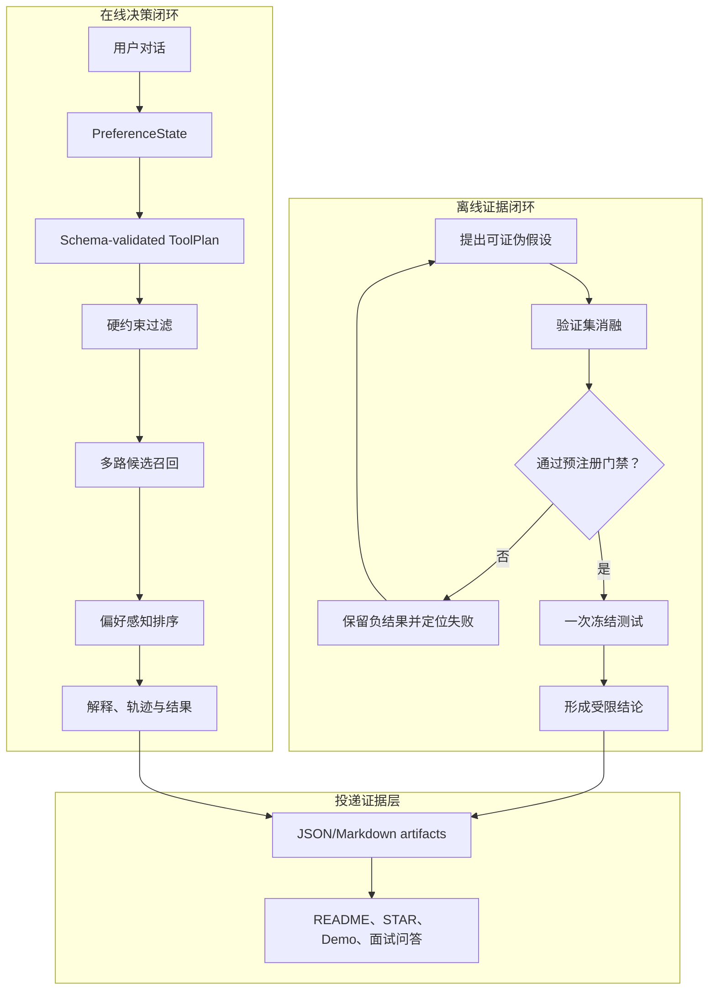

# RecAgent-Eval 项目方法论

> 从可运行的对话推荐原型，构建可评测、可解释、可复现、可投递的
> 搜推 × LLM Agent 项目。

更新日期：2026-08-22

## 1. 方法论定位

RecAgent-Eval 不把大语言模型当作推荐排序器，而把它放在更适合语言模型的
位置：理解自然语言偏好、维护对话状态、生成受约束的工具计划和组织推荐解释。
候选过滤、召回、排序和指标计算则交给确定性推荐模块。

项目采用三层闭环：

1. **在线决策闭环**：把用户对话稳定地转化为满足约束的推荐结果。
2. **离线证据闭环**：用分阶段指标定位瓶颈，以验证集门禁约束算法迭代。
3. **投递证据层**：让 README、简历和面试中的每项结论都能追溯到代码、配置、测试和实验产物。

核心方法可以概括为：

> **LLM 与推荐解耦，硬约束优先，多阶段指标诊断，验证集门禁，失败驱动迭代，Claim-to-Evidence 可追溯。**

这份文档描述当前真实状态：v1（DeepSeek 矩阵）和 v2（dense 召回 +
LambdaMART 证据契约）都已实现。凡标记为“待验证”或“下一步”的内容仍是计划，
只有通过预先定义的实验门槛后才能进入项目结论。

## 2. 项目要解决的问题

传统推荐系统擅长从行为数据中计算相似性和排序分数，但不擅长直接理解“想看
九十年代的科幻片，但不要恐怖片”这类自然语言。纯 LLM 推荐可以理解语言，
却容易产生不存在的电影、遗漏硬约束、计划格式不稳定，且难以做可复现的离线评测。

因此项目不追求让一个模型包办全部工作，而是拆解为四个问题：

| 问题 | 负责模块 | 核心评价标准 |
| --- | --- | --- |
| 用户到底想要什么 | LLM 偏好理解 | 偏好保持率、结构化结果合法率 |
| 应按什么顺序调用能力 | LLM ToolPlan + schema validator | 计划合法率、修复率、回退率 |
| 哪些电影可以推荐 | 硬过滤 + 多路召回 | 约束满足率、候选召回率 |
| 哪些候选应排在前十 | 确定性或可学习排序器 | Recall@10、NDCG@10、HitRate@10 |

这种拆分使失败可以被定位：推荐不正确时，可以分别判断是偏好理解失败、计划失败、
过滤错误、目标未进入候选集，还是目标进入候选集但排序过低。

## 3. 三层闭环总览



三个层次不能互相替代：在线链路可运行不代表推荐有效；离线指标提升不代表系统可靠；
简历表述完整也不代表其背后有可复现证据。

## 4. 在线决策闭环

### 4.1 偏好状态：把自然语言变成可维护状态

每轮对话不直接生成电影列表，而是先产生结构化偏好增量并更新
`PreferenceState`。状态包含喜欢和不喜欢的电影或类型、年份范围、硬排除项、
推荐数量和排序偏好。

方法原则：

- **增量更新**：当前轮只描述变化，历史偏好由状态合并规则维护。
- **硬软分离**：排除项和明确限制属于硬约束；一般兴趣属于软偏好。
- **语义优先、字段受控**：LLM 可以理解表达，但只能写入约定字段。
- **可检查**：多轮对话后可以直接展示状态，判断偏好是否遗失或冲突。

### 4.2 工具计划：允许推理，不允许任意执行

LLM 输出类型化 `ToolPlan`，可用工具被限制为 `lookup`、`hard_filter`、
`itemcf_retrieve`、`semantic_retrieve`、`rerank` 和 `explain`。

执行策略是：

1. 使用 schema 校验工具名称、参数和顺序。
2. 非法计划最多请求 LLM 修复一次。
3. 修复仍失败时使用确定性安全计划。
4. 对外只保存必要且脱敏的验证错误、工具轨迹和计数，不保存密钥或完整私有提示。

这里的目标不是证明 LLM 永不犯错，而是证明错误不会无约束地进入推荐执行层。

### 4.3 硬约束优先

年份、明确排除类型、已看电影和指定排除项必须在进入最终排序前得到执行。
软偏好可在空候选时逐级放宽，硬排除不能放宽。

因此系统质量按优先级判断：

1. 排除项违规率必须为 0。
2. 硬约束满足率达到门槛。
3. 在合法候选内优化 Top-K 质量。

不能用更高的 NDCG 为违反用户明确约束辩护。

### 4.4 召回与排序职责分离

召回答“目标是否进入候选集”，排序回答“进入候选集后能否进入前十”。v1 使用
ItemCF 和标题/类型 TF-IDF 双路召回；v2 增加了 `all-MiniLM-L6-v2` dense 路线
和十特征 LambdaMART 可学习重排器，评测纪律不变。

候选合并后保留来源、原始分数、route rank 和偏好匹配特征。排序器只能读取训练或
验证阶段合法生成的特征，不能接触测试目标。

### 4.5 解释从证据生成

解释应来自已经执行的偏好、约束和候选特征，而不是让 LLM 事后自由编造原因。
一条可接受的解释至少能回答：

- 命中了哪项显式偏好；
- 来自哪条召回路线；
- 哪些硬约束已检查；
- 主要排序分数组成是什么。

## 5. 离线证据闭环

### 5.1 从可证伪假设开始

每次算法改动先写出“为什么可能有效”和“什么结果代表失败”。例如：

> 假设：真实语义 embedding 能提高类型文字无法覆盖的相似电影候选召回；如果
> semantic-only target coverage 没有提升，或提升只来自泄漏，则假设失败。

> 假设：使用 route、流行度和偏好匹配特征的正则化重排器能识别值得提升的
> semantic-only 候选；如果交叉验证 NDCG@10 未稳定超过同深度 ItemCF，则不解锁测试。

假设必须对应可计算指标，不能以“效果看起来更智能”作为成功标准。

### 5.2 时间顺序切分与信息边界

MovieLens 用户交互按时间顺序切分。训练历史用于 ItemCF、用户画像和训练特征；
验证目标用于模型选择与超参数选择；测试目标只用于冻结后的最终评估。

必须禁止：

- 把验证或测试目标放入用户语义画像；
- 使用完整数据计算含未来信息的流行度或相似度；
- 根据测试结果继续更换特征、权重或模型；
- 对失败测试反复重跑并只保留较好结果。

数据指纹、案例指纹、配置和随机种子必须随实验产物保存。

### 5.3 分阶段指标，而非单一总分

| 阶段 | 主要指标 | 用途 |
| --- | --- | --- |
| Agent | 计划合法率、修复率、回退率、偏好保持率 | 判断语言理解与规划是否可靠 |
| 执行 | 工具成功率、pipeline 成功率 | 判断工程链路是否稳定 |
| 约束 | 硬约束满足率、排除项违规率 | 判断推荐是否安全、可控 |
| 召回 | 各 route candidate recall、union recall | 判断目标是否进入候选集 |
| 排序 | Recall@10、NDCG@10、HitRate@10 | 判断候选能否进入前十及位置质量 |
| 系统 | p50/p95 latency、调用次数、tokens、失败率 | 判断成本和可用性 |

只有 union candidate recall 提升而 NDCG 下降时，结论应是“召回扩展成功、排序校准失败”，
而不是笼统宣称完整推荐效果提升。

### 5.4 对照、消融和公平比较

正式对照至少包含：

1. 非结构化、无跨轮记忆的上游风格基线。
2. 结构化计划 + 偏好记忆 + ItemCF。
3. 结构化计划 + 偏好记忆 + 多路召回与融合排序。

每个消融只改变一个可解释因素，并尽量共享同一数据切分、候选深度、历史上限和评测
用户。若某基线使用 popularity fallback，报告必须明确说明，不能把它解释成纯粹由
“无记忆”带来的优势。

### 5.5 验证集门禁与冻结测试

新方法必须先在验证集或 nested validation / cross-validation 中超过同条件 ItemCF。
建议 v2 门禁同时满足：

- 平均 NDCG@10 严格高于同深度 ItemCF；
- 提升在多数 folds 或 seeds 中方向一致；
- bootstrap 区间和效应量被完整报告；
- 硬约束、数据指纹和候选策略没有漂移；
- 资源开销没有超出单机或单卡项目预算。

门禁失败时：保存所有候选结果、保持冻结测试锁定、停止新的付费 LLM 正式评测。
门禁通过时：冻结模型、特征、配置和指纹，只进行一次测试评估。

### 5.6 失败驱动迭代

负结果不是需要隐藏的瑕疵，而是下一项实验的依据。迭代顺序应遵循最小充分改动：

```text
观察指标异常
→ 定位到 Agent / 过滤 / 召回 / 排序中的具体阶段
→ 提出一个可证伪原因
→ 设计最小消融
→ 验证集判断
→ 通过则冻结测试；失败则记录并停止该路线
```

当前 v1 就是一个实例：TF-IDF 提高 union candidate recall，却没有提高 Top-10，
RRF 和 percentile fusion 也未通过验证门禁。因此下一步合理实验是增加能判断候选质量的
特征和正则化重排器，而不是继续尝试更多无监督分数混合公式。

## 6. v1 证据与 v2 证据的边界

### 6.1 v1 已验证事实

- 229 个测试通过，当前 line coverage 为 90%。
- 约束感知 DeepSeek 评测中，结构化方案的计划合法率、pipeline、工具执行和硬约束指标达到 100%。
- 正式矩阵中，ItemCF route candidate recall 为 0.78，完整双路 union recall 为 0.88。
- 完整方案 Recall@10 为 0.04、NDCG@10 为 0.0149，没有超过结构化 ItemCF。
- 500 用户验证消融中 ItemCF NDCG@10 为 0.033388；新测试的 RRF 和 genuine percentile fusion 未通过门禁。
- 冻结测试保持锁定，没有为寻找更好结果而重复运行。

### 6.2 v2 已验证事实

- dense 缓存（`all-MiniLM-L6-v2`，3,883×384）构建成功，schema/指纹/修订校验
  与稳定加载通过。
- 真实训练中的 LightGBM 段错误已根因定位（torch/LightGBM/scikit-learn 三份
  `libomp.dylib` 共存）并修复，两个子进程回归测试守护；30-user 与 500-user
  训练均完成并发布 bundle。
- 500 用户验证：约束满足率 100%；LambdaMART NDCG@10 0.0327 vs ItemCF 0.0334，
  bootstrap 95% CI [−0.0146, 0.0129] 跨零；并集候选召回 77.6%、dense 28.8%。
- 无 API Key 的离线 Demo 已可运行，并生成本地截图（rule-based 标注）。

### 6.3 不能宣称的内容

- 不能宣称双路召回提升了最终推荐质量。
- 不能宣称当前系统超过 ItemCF 或流行度基线。
- 不能声称 LambdaMART 超过 ItemCF：500 用户验证是负结果，frozen 门保持锁定。
- 不能把 rule-based Demo 表述成 LLM 效果。
- 不能声称 Qwen/vLLM 4090 实验已完成或报告其吞吐/显存。
- 不能把 50 个固定案例的结果泛化为所有电影推荐场景。

### 6.4 v2 剩余待验证/下一步

- 提高 dense 候选召回（当前仅 28.8%）与并集候选召回（77.6%），例如扩充
  dense 通道的 top-k、改进 item text schema 或增加候选策略。
- 在候选召回改善后重新评估分数校准与 LambdaMART 特征质量，只有离线 NDCG
  改善才考虑 frozen 重跑。
- Qwen smoke 与主结果分开报告；Qwen/vLLM 4090 冒烟待服务器空闲。

## 7. 工程方法论

### 7.1 配置与依赖

- 实验参数进入 YAML，不散落在命令或源码常量中。
- 使用锁定依赖和固定随机种子；记录 Python、模型、硬件和数据版本。
- 第三方模型进入项目前核对许可证、模型卡、下载大小和推理资源。
- item embedding 预计算并按模型与数据指纹缓存，避免重复计算和隐式漂移。

### 7.2 接口与模块边界

公开接口承担稳定契约：`LLMProvider` 隔离模型服务，`PreferenceState` 隔离对话状态，
`ToolPlan` 隔离规划与执行，`RecommendationResult` 统一结果、轨迹、延迟和异常。

新 embedding 或 ranker 应实现独立接口，不让 Demo、Agent 或 evaluator 依赖具体模型内部。
这种边界使 provider、retriever 和 ranker 可以分别 mock、替换和测试。

### 7.3 错误与降级

| 失败 | 处理策略 |
| --- | --- |
| API timeout / rate limit | 有限重试，记录错误，必要时走确定性 provider |
| 无效 JSON / 未知工具 | 一次修复，仍失败则安全计划回退 |
| embedding 不可用 | 回退 TF-IDF 或 ItemCF，并在结果中标明降级 |
| 空候选 | 逐级放宽软偏好，永不放宽硬排除 |
| ranker artifact 不匹配 | 拒绝评测，不静默使用其他配置 |
| 测试门禁未通过 | 拒绝读取或运行冻结测试 |

降级的目标是保持系统可用和结果可解释，不是掩盖失败。所有降级都应进入 sanitized trace。

### 7.4 测试金字塔

- **单元测试**：状态合并、schema、过滤、召回、特征、排序、指标和 gate。
- **契约测试**：DeepSeek/vLLM provider 的响应字段、超时和错误语义。
- **集成测试**：小型 MovieLens 数据完成对话到 artifact 的端到端链路。
- **故障测试**：无效计划、API 失败、缺失模型、空候选和 fingerprint mismatch。
- **回归测试**：固定案例、配置和非 LLM 路径保持确定性。
- **CI smoke**：lint、测试和最小 CLI，不在公共 CI 中依赖私有 key 或大型模型。

## 8. Demo 方法论

Demo 不是另一个推荐实现，而是核心链路的可视化观察器。目标是让面试官在一次交互中看见：

1. 用户语言如何变成结构化偏好；
2. LLM 计划经过什么校验；
3. 哪些硬约束被执行；
4. 推荐候选来自 ItemCF、semantic 还是两者；
5. 最终分数由哪些特征贡献；
6. API 失败时系统如何降级。

Demo 必须提供不依赖付费 API 的离线模式，并使用会话级状态，避免不同用户共享
`PreferenceState`。展示的分数和轨迹必须来自实际执行结果，不能另造一套静态故事。

## 9. 投递证据层

### 9.1 Claim-to-Evidence 规则

每项对外表述都应能回答“证据在哪里”：

| Claim 类型 | 最低证据 |
| --- | --- |
| 实现了某模块 | 源码入口 + 测试 |
| 提升了某指标 | 固定配置 + 指纹 + 对照表 + machine-readable artifact |
| 提高了可靠性 | 固定案例 + 失败口径 + 聚合指标 |
| 支持某模型或硬件 | 可复现命令 + 实际运行日志 + 资源记录 |
| 工程质量 | CI 记录 + 测试数 + coverage 口径 |

简历和 README 只使用已完成实验的过去式；待验证目标使用“计划”“目标”或“下一步”。

### 9.2 面试叙事

推荐的项目讲法不是“我调用了 LLM 做推荐”，而是：

> 我把对话式推荐拆成语言理解和确定性推荐两部分，用 schema、硬约束和回退保证
> Agent 可靠性；再用分阶段指标发现双路召回虽然提高候选覆盖，却因排序校准失败
> 没有提高 NDCG。随后通过验证集门禁约束下一步 learned reranker 实验，并保留负结果，
> 避免测试集反复调参。

这段叙事同时体现 Agent 工程、推荐系统、实验设计和问题诊断能力。

## 10. 项目决策规则

后续每个新增需求都依次回答：

1. 它解决的是哪个已观测瓶颈？
2. 是否有更小、更便宜的实验可以先证伪？
3. 需要哪些数据，是否可能泄漏？
4. 成功和失败的量化标准是什么？
5. 会改变哪些接口、配置、artifact 和测试？
6. 失败后是否仍形成可用于面试的真实证据？

如果无法回答第 1、2、4 项，就暂不实现。该规则用于避免在一周项目中加入多 Agent、
训练大型深度排序模型、扩展第二数据集或无目的更换 LLM 等低收益工作。

## 11. 投递就绪门槛

项目只有在以下条件同时满足时，才建议作为主要项目投递：

- 当前分支的 lint、测试、CI 和 smoke test 全部通过。
- 推荐指标来自合法的数据切分，测试集没有参与特征、调参或方案选择。
- 排序提升有完整对照、消融和不确定性报告；若未提升，则对外结论已收缩且保持诚实。
- 计划合法率、工具成功率、硬约束满足率和排除项违规率达到预设门槛。
- Demo 无 API Key 也能展示完整核心链路，并具备会话隔离。
- README 包含快速开始、架构、真实结果、限制、复现命令和实际截图。
- 简历 STAR、面试问答、演示稿与仓库 artifact 一致。
- Qwen 尚未运行时明确标记 pending，不将其写成已支持的实测结果。

## 12. 方法论的最终价值

RecAgent-Eval 的价值不取决于一次实验是否超过基线，而取决于是否建立了可信的问题解决过程：

- 能把 LLM 擅长的语言能力与推荐模块的可复现计算结合起来；
- 能让约束错误、召回失败和排序失败被分别观测；
- 能用实验门禁保护测试集，避免为了结果而调参；
- 能把成功与失败都转化成可追溯的工程证据；
- 能在面试中清楚说明设计选择、指标变化、失败原因和下一步实验。

这套方法论也是后续 v2 优化的最高约束：先定位、再假设；先验证、再测试；先有证据、
再写结论。
